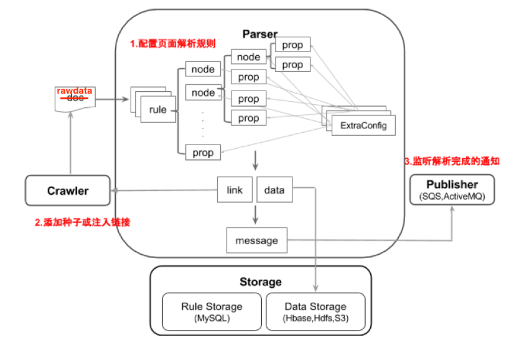
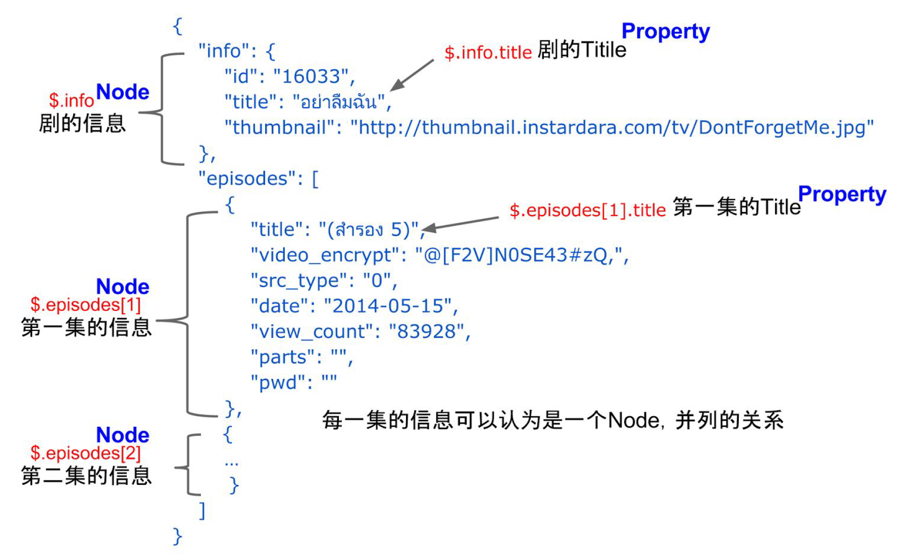
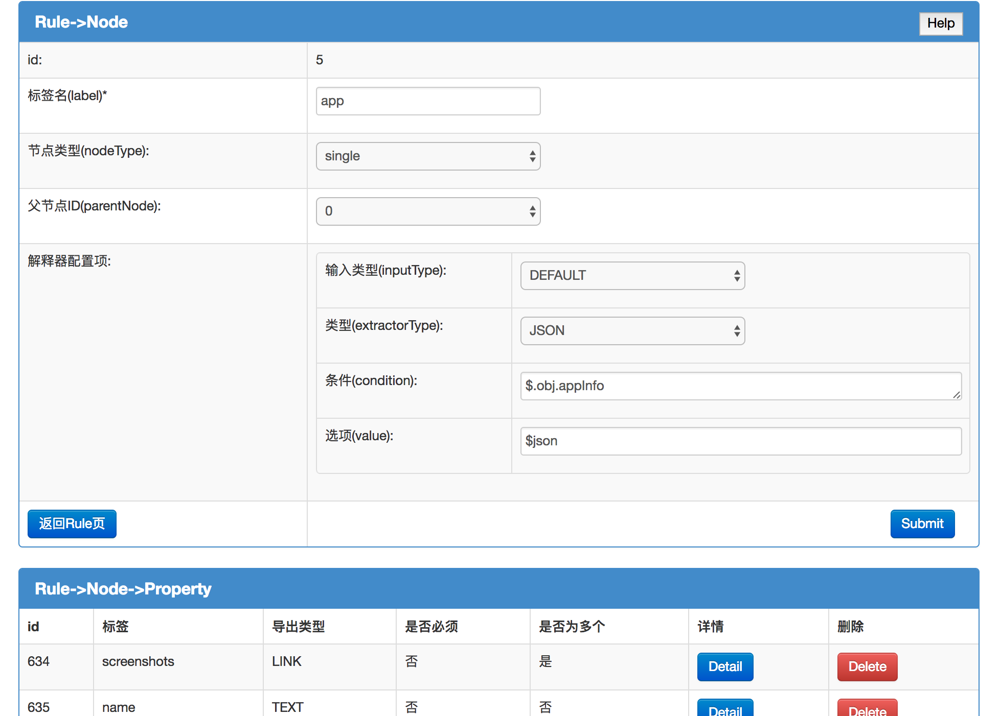
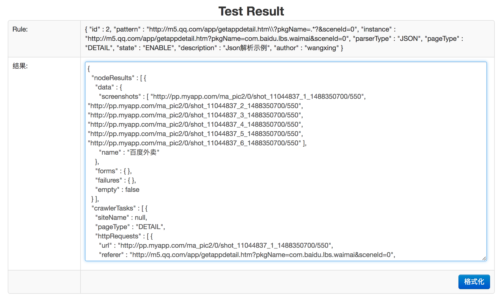

# uni-parser
通用解析(Uni-Parser)支持对XML/JSON/HTML等不同格式的数据统一进行解析，往往与爬虫进行协同工作。在爬虫系统中，爬虫负责抓取指定的文本，通用解析负责对该文本进行解析，形成通用的数据格式，同时抽取出子连接，交给爬虫继续爬取。

### 概览：

### 基本概念：
* Rule
  * 每个Rule定义了一套对于符合某个Pattern的URL的内容进行解析的规则；
* Node
  * Node代表一个数据节点，例如一部电影，数据形式上往往是一段HTML、JSON或是XML；
  * Node可并列出现，例如一个XML文件中可以包含多部电影；
  * Node下往往包含多个Property，例如一部电影的数据中包括电影名，上映时间等；
  * Node除了可包含多个Property外，还可以有嵌套的子Node，例如一部电影的数据中上映该电影的影院列表就是多个嵌套的Node，每个影院就是一个Node，包含地址，名称等信息。

* Property
  * Property是Node的属性，没有类似Node那样的嵌套结构，例如电影的电影名，上映时间等都是Property；
  * Property也可并列出现，例如一部电影下可以有多个演员；
* ExtraConfig
  * 用于抽取Node和Property的“值”，Node的“值”往往是一段Html、Json或是Xml，
Property的值往往是一个字符串；
  * 一个Node有且只有一个ExtraConfig，一个Property可以配置多个ExtraConfig，多
个ExtraConfig顺序处理得到Property最终的值；
  * 每个ExtraConfig会使用一个Extractor，每个Extractor有特定的用途，例如用于解析XML数据的XMLExtractor。

### 解析：
* 每个Extractor都有自己特定的用途，例如解析JSON的JsonExtractor。每个Extractor接口上统一提供两个方法，cond指Node或是Prop的定位，即XPath/JsonPath/CssSelector：
  * 单值解析: String extract(String input, String cond, String value);
  * 多值解析: List<String> extractMulti(String input, String cond, String value)

* XML
  * XML文本的解析工具使用[VTDXML](http://vtd-xml.sourceforge.net)。VTDXML是一种无提取的XML解析方法，它解决了DOM占用内存过大的缺点，并且还提供了快速的解析与遍历、对XPath的支持和增量更新等特性，处理效率是DOM的几十倍。
* HTML
  * HTML文本的解析工具使用[Jsoup](https://jsoup.org)。Jsoup 是一款Java的HTML解析器，可直接解析某个URL地址、HTML文本内容。它提供了一套非常省力的API，可通过DOM，CSS以及类似于jQuery的操作方法来取出和操作数据。
* JSON
  * Json文本的解析工具使用[JsonPath](https://github.com/json-path/JsonPath)。

### 系统运行：
1. 本地启动MySQL和Redis，修改项目中的相应配置
2. 运行parser-dao的script目录下初始化数据库的脚本，导入解析示例
3. 运行parser-web, mvn -Djetty.port=8080 jetty:run
4. 打开游览器访问：http://localhost:8080/admin/rule/index

### 系统截图：
* 解析规则的录入

* 解析规则的测试
